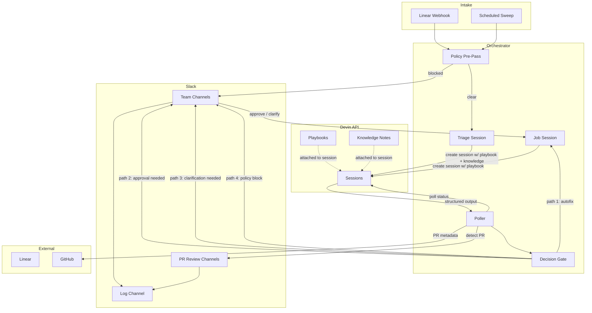

# Backlog Autopilot

An orchestration system that triages, routes, and resolves Linear backlog issues using Devin as the execution engine. Issues flow through a structured pipeline — Devin investigates and proposes fixes, deterministic policy gates decide what happens next, and engineers stay in control through Slack.

Built as a Bun monorepo with three components: an Express orchestrator that manages the pipeline, a Next.js control plane for visibility, and a shared schema package.

## Setup & Running

### Prerequisites

- [Bun](https://bun.sh/) v1.1+
- A Devin API key and organization ID
- A Linear API key with access to the target project
- A Slack app with Socket Mode enabled (bot token + app-level token)
- A GitHub token for PR metadata lookups
- [ngrok](https://ngrok.com/) or equivalent for exposing the webhook endpoint to Linear

### Environment

Copy `.env.example` to `.env` at the repo root:

```
DEVIN_API_KEY=cog_...
DEVIN_ORG_ID=...
LINEAR_API_KEY=lin_api_...
SLACK_BOT_TOKEN=xoxb-...
SLACK_APP_TOKEN=xapp-...
SLACK_BOT_USER_ID=U0XXXXXXXX
GITHUB_TOKEN=ghp_...
NGROK_URL=https://...ngrok-free.app
```

### Install & Setup

```bash
bun install

# Push playbooks and knowledge notes to Devin, store config IDs locally
bun run setup
```

Setup creates four resources in the Devin API:
- **Triage playbook** — instructions for how Devin should investigate and classify an issue
- **Job playbook** — instructions for how Devin should implement a fix
- **Routing rules knowledge note** — keyword-to-team mapping that Devin reads during triage
- **Team directory knowledge note** — team ownership, Slack channels, and code areas

The IDs for these resources are stored in a local SQLite database (`data/autopilot.db`) so the orchestrator can reference them when creating sessions.

### Run

```bash
# Start the orchestrator (Express + Slack Socket Mode + poller)
bun run dev:orchestrator

# Start the control plane dashboard (Next.js, port 3000)
bun run dev:control-plane

# Expose the orchestrator for Linear webhooks
ngrok http 3001
```

Configure the Linear webhook to point at `{NGROK_URL}/api/webhooks/linear` for issue create/update events.

### Manual Sweep

```bash
# Sweep the backlog — pulls unstarted issues from Linear, triages top N
bun run sweep
```

## Project Structure

```
backlog-autopilot/
├── apps/
│   ├── orchestrator/          # Express server — pipeline, Slack bot, poller
│   │   ├── scripts/
│   │   │   ├── setup.ts       # Push playbooks + knowledge to Devin API
│   │   │   └── sweep.ts       # CLI entry point for backlog sweep
│   │   └── src/
│   │       ├── index.ts       # Express app, startup, route registration
│   │       ├── config.ts      # Blueprint YAML loader
│   │       ├── db.ts          # SQLite schema and connection
│   │       ├── devin.ts       # Devin API client (sessions, playbooks, knowledge)
│   │       ├── ledger.ts      # Append-only event log
│   │       ├── linear.ts      # Linear SDK wrapper
│   │       ├── pipeline.ts    # Core pipeline — triage, decision gate, dispatch, PR handling
│   │       ├── poller.ts      # Session status poller (Devin has no webhooks)
│   │       ├── routing.ts     # Read/write routing rules in Devin Knowledge
│   │       ├── sweep.ts       # Backlog sweep logic
│   │       ├── triage.ts      # Policy checks and decision gate
│   │       ├── slack/
│   │       │   ├── app.ts     # Slack Bolt setup, message helpers
│   │       │   ├── commands.ts# Action handlers (approve, claim, override, correct routing)
│   │       │   └── messages.ts# Block Kit message builders
│   │       └── webhooks/
│   │           └── linear.ts  # Linear webhook handler
│   └── control-plane/         # Next.js dashboard
│       └── app/
│           ├── page.tsx       # Audit trail
│           ├── config/        # Blueprint + routing rules viewer
│           ├── metrics/       # Digest metrics
│           └── scheduling/    # Sweep trigger + countdown
├── config/
│   └── blueprint.yaml         # Policy rules, thresholds, channel routing
├── packages/
│   └── shared/                # Zod schemas shared across apps
│       └── src/schemas/
│           ├── blueprint.ts   # Blueprint schema
│           ├── triage.ts      # Triage structured output schema
│           └── ledger.ts      # Ledger event schema
├── playbooks/
│   ├── triage.md              # Devin playbook: investigate and classify
│   └── job.md                 # Devin playbook: implement the fix
└── data/
    └── autopilot.db           # SQLite — ledger, active sessions, config store
```

## Architecture



## Key Principles

### Deterministic guardrails, non-deterministic intelligence

The system splits decision-making between two layers. The orchestrator handles everything that should be predictable: policy checks against the blueprint (blocked labels, blocked file paths), the auto-dispatch threshold (complexity + safety flags), and channel routing from team ID to Slack channel. These are pure functions over configuration — no LLM involved.

Devin handles what benefits from reasoning: reading the issue, investigating the codebase, identifying affected files, forming a root cause hypothesis, suggesting an approach, and determining which team owns the code. This is where non-determinism is valuable — the same issue described differently should still get triaged correctly.

The boundary is intentional. The orchestrator never asks Devin whether to bypass a policy, and Devin never decides which Slack channel to post to. Each system does what it's good at.

### Transparency and auditability

Every action in the pipeline writes to an append-only ledger (`ledger_events` table). Triage started, triage completed, auto-dispatched, approval requested, human claimed, PR created, routing corrected — each event captures the issue, the decision path, the responsible team, the Devin session URL, and any relevant metadata.

Slack messages link directly to Devin sessions so engineers can inspect exactly what Devin investigated. Triage details (root cause hypothesis, suggested approach, affected files) are posted as thread replies. The control plane dashboard renders the full ledger as an audit trail.

The goal: anyone should be able to look at any issue and trace the complete sequence of decisions — automated and human — that led to the current state.

### Self-improving routing

When Devin triages an issue, it reads two Knowledge notes: routing rules (keyword-to-team mappings) and a team directory (who owns what). When an engineer corrects a routing decision via Slack's "Correct Routing" button, the orchestrator appends a learned pattern to the routing rules Knowledge note through the Devin API.

The next time Devin triages a similar issue, it sees the correction in its context and routes accordingly. The system accumulates institutional knowledge about which team owns what — without requiring anyone to manually maintain a routing config.

### Human-in-the-loop by default

Auto-dispatch is the narrow exception, not the default. An issue only skips human review if it meets all of: complexity is small or medium, `safe_to_autofix` is true, and `requires_product_decision` is false. Everything else — high complexity, uncertain fixes, product decisions, policy-sensitive areas — routes to the responsible team's Slack channel with action buttons.

Engineers can approve a fix, claim it themselves, override a policy block, correct the routing, or provide clarification. The system is designed to be useful even when it can't fully automate — a triage brief with root cause analysis and affected files saves investigation time regardless of whether Devin ultimately writes the fix.

## Build vs. Buy: Working With the Devin Platform

### Why build a custom orchestrator instead of using Devin's native Linear integration?

Devin can natively watch Linear for new issues via triggers, but that's a direct pipe: issue appears, Devin session starts. There's no room for a policy gate, a multi-path decision, or structured routing logic between intake and execution. The orchestrator exists to insert that control layer — check policy blocks before spending compute on triage, enforce auto-dispatch thresholds, route to different Slack channels based on team ownership, and handle the four distinct paths (autofix, approval, clarification, policy block) that a single Devin trigger can't express.

### Why build a custom Slack bot instead of using Devin's built-in Slack?

Devin has native Slack support, but it's oriented around conversational interaction with a single session. The orchestrator needs structured UI that Devin's Slack integration doesn't provide: approval buttons that dispatch a job session, a routing correction modal that writes to Knowledge, threaded clarification replies that auto-resolve and feed context into a new session, and button dismissal after action. These are Slack Block Kit interactions that require a custom bot with registered action handlers.

### Why polling instead of webhooks?

The Devin API does not offer session completion webhooks. The orchestrator runs a 15-second poller that checks all active sessions tracked in the `active_sessions` table. When a triage session's structured output is populated, or a job session reaches a terminal status, the poller fires the appropriate pipeline handler. The poller also detects PRs on job sessions before the session completes, enabling early notification to review channels without waiting for Devin to finish.

### Why Knowledge notes instead of local routing config?

Routing rules need to be readable by Devin during triage sessions — that's where the team assignment decision happens. If routing rules lived only in the orchestrator's config, Devin would have no context for deciding `responsible_team`. By storing them as Knowledge notes and attaching them to triage sessions via `knowledge_ids`, Devin sees the full routing rules and team directory as part of its context. This also enables the learning loop: the orchestrator writes corrections back to the same Knowledge note that Devin reads.

### Why SQLite?

The orchestrator needs three things persisted locally: the ledger (append-only event log), active session tracking (which Devin sessions to poll), and config IDs (playbook and Knowledge note references from setup). SQLite in WAL mode handles all three with zero infrastructure. The control plane reads the same database file directly. There's no need for a database server — the system runs as a single process.

## Lifecycle of an Issue

### 1. Intake

Issues enter the pipeline through two paths:

**Linear webhook** (`webhooks/linear.ts`) — When an issue is created or updated in Linear, the webhook handler extracts the identifier, title, description, priority, labels, and due date. It runs a policy pre-pass against the blueprint's blocked labels. If blocked, it logs the event and stops. Otherwise, it calls `triggerTriage()`.

**Scheduled sweep** (`sweep.ts`) — Pulls unstarted/backlog/triage issues from Linear via the API, sorted by priority. Skips any issue already in the ledger. Triages up to N issues (default 3) per sweep. Can be triggered manually via `bun run sweep` or through the control plane's sweep button.

### 2. Triage

`triggerTriage()` in `pipeline.ts` creates a Devin session with:

- A **prompt** containing the issue details (title, description, priority, labels, due date)
- The **triage playbook** — instructs Devin to investigate the codebase, identify affected files, form a root cause hypothesis, and fill in the structured output. Explicitly forbids Devin from modifying any files.
- **Knowledge notes** — routing rules and team directory, attached via `knowledge_ids` so Devin can determine `responsible_team`
- A **structured output schema** — a JSON Schema that Devin fills in with typed fields: `issue_category`, `complexity`, `confidence`, `affected_files`, `root_cause_hypothesis`, `suggested_approach`, `safe_to_autofix`, `requires_clarification`, `requires_product_decision`, `responsible_team`, and more
- The **target repo** and a **session link** back to the Linear issue

The session is registered in the `active_sessions` table and the poller begins tracking it.

### 3. Decision Gate

When the poller detects that the triage session's structured output is populated, it calls `handleTriageComplete()`. The structured output is validated against the Zod schema (`TriageOutputSchema`), then passed to `makeDecision()` in `triage.ts`.

The decision gate is fully deterministic. It checks, in order:

1. **Policy block** — Does the triage output reference affected files matching `blueprint.policy.blocked_paths`? Does the issue require a product decision? If either, route to **path 4: policy block**.

2. **Clarification needed** — Did Devin flag `requires_clarification`? Route to **path 3: clarification**.

3. **Auto-dispatch eligible** — Is `complexity` at or below `blueprint.triage.auto_dispatch_threshold.max_complexity`? Are all conditions in `requires` met (e.g., `safe_to_autofix` is true, `requires_product_decision` is false)? If all pass, route to **path 1: autofix**.

4. **Default** — Everything else routes to **path 2: approval needed**.

Each path posts a message to the responsible team's Slack channel (resolved via `blueprint.notifications.team_channels[triage.responsible_team]`) with triage details in a thread and path-appropriate action buttons.

### 4. Dispatch

When a fix is dispatched — either automatically (path 1) or after human approval/clarification — `dispatchJob()` creates a new Devin session with:

- A **prompt** containing the triage context: root cause hypothesis, suggested approach, affected files, and any clarification text from an engineer
- The **job playbook** — instructs Devin to investigate, implement the fix, run tests, record verification, create a branch named with the Linear identifier (for auto-linking), and open a PR
- The **target repo** and a **session link** to the triage session for reference

The job session is tracked by the poller the same way triage sessions are.

### 5. PR Notification

The poller has special handling for job sessions: it checks for `pull_requests` on every poll cycle, not just at session completion. When a PR appears, it immediately fires `handleJobComplete()` — which fetches PR metadata from the GitHub API (title, lines added, files changed), checks for a verification video in the session attachments, and posts a review notification to the team's PR review channel (`blueprint.notifications.pr_channels`).

This means engineers see the PR as soon as Devin opens it, without waiting for the session to fully terminate.

### 6. Human Feedback Loop

Every Slack message in the pipeline includes contextual action buttons. The available actions depend on the decision path:

**Approval path** — "Approve Fix" dispatches a job session. "I'll Handle This" logs a human claim and stands down.

**Policy block path** — "Override & Dispatch" lets an engineer bypass the policy gate and dispatch anyway. "I'll Take This" claims the issue and assigns it in Linear (matching Slack user email to Linear user). "Correct Routing" opens a modal to reassign to a different team.

**Clarification path** — The message is posted as a thread. When an engineer @mentions the bot in the thread with context, `handleClarificationReply()` captures the text, logs a `clarification_resolved` event, and auto-dispatches a job session with the clarification appended to the prompt. A one-shot guard prevents duplicate dispatches.

**Routing correction** — Available on all paths. Opens a Slack modal with a team dropdown. On submit, the orchestrator calls `addLearnedPattern()` which reads the current routing rules Knowledge note from the Devin API, appends a new pattern (e.g., `"Fix encryption for API keys" -> team-platform`), and writes it back. It then re-posts the triage message to the correct team's channel and logs the correction.

All button interactions dismiss the action buttons after click, replacing them with a status line (e.g., "Approved by @user") to prevent double-actions.

## Configuration

### Blueprint (`config/blueprint.yaml`)

The blueprint controls the orchestrator's deterministic behavior:

```yaml
triage:
  auto_dispatch_threshold:
    max_complexity: "medium"           # max complexity for auto-dispatch
    requires: ["safe_to_autofix", "!requires_product_decision"]

policy:
  blocked_paths:                       # file patterns that require manual review
    - "supabase/migrations/*"
    - "packages/ai/src/prompts/*"
  blocked_labels: ["compliance", "auth", "billing"]

notifications:
  team_channels:                       # team ID -> Slack channel for triage messages
    team-ai: "#team-ai"
    team-platform: "#team-platform"
    team-frontend: "#team-frontend"
    team-sdk: "#team-sdk"
  pr_channels:                         # team ID -> Slack channel for PR reviews
    team-ai: "#team-ai-pr-reviews"
    team-platform: "#team-platform-pr-reviews"
    team-frontend: "#team-frontend-pr-reviews"
    team-sdk: "#team-sdk-pr-reviews"
  log_channel: "#auto-backlog-updates" # all events logged here
```

The blueprint is loaded once at startup and cached. It is never sent to Devin — it only governs the orchestrator's own logic.
